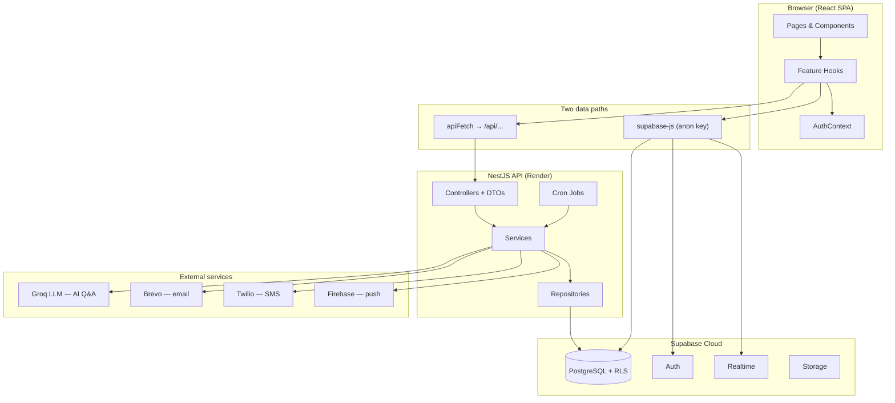

# CareCircle — Design & Testing Document

MSSE Capstone 2026 · Quantic School of Business and Technology

This document satisfies the capstone requirement for a design and testing write-up: architecture decisions, patterns used, deployment options, and the testing strategy implemented in the repository.

---

## 1. System overview

CareCircle is a **caregiving coordination platform** that helps families manage medication schedules, daily checklists, handover journals, appointments, wellbeing check-ins, and emergency contacts for a loved one receiving care at home.

The system is a **monorepo** with two standalone npm packages:

| Package | Role |
|---------|------|
| `frontend/` | React 19 SPA (Vite + TypeScript + Tailwind) |
| `backend/` | NestJS 11 REST API |
| `supabase/` | PostgreSQL schema, migrations, RLS policies |
| `e2e/` | Playwright API smoke tests against deployed backend |
| `.github/workflows/` | CI/CD (lint, test, build on every PR) |

**Live deployment (Render):**

- Frontend: https://carecircle-frontend.onrender.com
- Backend: https://carecircle-backend-v3j7.onrender.com
- Database/Auth: Supabase Cloud

---

## 2. Architecture

### 2.1 High-level diagram



### 2.2 Backend — layered architecture (NestJS)

**Pattern:** Feature-per-module with a strict request flow:

```
HTTP Request → Controller (DTO + class-validator)
            → Service (business logic)
            → Repository (integrations/repositories/*)
            → SupabaseAdminClient (service-role key)
```

**Cross-cutting concerns** wired globally in `backend/src/app.module.ts`:

- `ValidationPipe` — whitelist DTO fields, reject unknown properties
- `HttpExceptionFilter` — consistent error responses
- `LoggingInterceptor` + `TraceContextInterceptor` — structured JSON logs with trace IDs
- `AppThrottlingModule` — 100 requests/minute per IP
- `DevOnlyGuard` — `/api/dev/*` returns 404 outside development

**Feature modules:** medications, checklist (materialization + overdue detection), alerts (push/SMS), cron, reminders, insights, shifts, AI Q&A, hospital-summary PDF, document-storage, invites, SMS.

**Cron jobs** (`backend/src/cron/cron.jobs.ts`) run scheduled tasks: checklist materialization, overdue detection, insight generation, appointment reminders, SMS fallback.

### 2.3 Frontend — feature hooks + dual data path

**Pattern:** No global state library (Redux/Zustand). State lives in `AuthContext` and per-feature custom hooks under `frontend/src/hooks/` and `frontend/src/api/<feature>/`.

| Path | Used for | Auth model |
|------|----------|------------|
| `apiFetch` / axios → backend `/api/...` | Medication mutations, AI chat, hospital summary PDF, insights, push registration | No JWT validation on backend (see §5) |
| Direct `supabase-js` (anon key) | Group list, appointments, checklist confirmations, journal, wellbeing, invite RPCs | Supabase session; RLS enforced |

**Development:** Vite dev server (`localhost:5173`) proxies `/api` → `localhost:3000`.

**Production:** Frontend build sets `VITE_API_BASE_URL` to the Render backend URL; services prefix all API calls.

### 2.4 Database — Supabase PostgreSQL with RLS

**Pattern:** Row Level Security (RLS) on all sensitive tables. Helper functions (`is_group_member()`, `is_caregiver_for()`) enforce **cross-circle isolation** — a caregiver in Circle A cannot read or write Circle B data.

**Role model** (`group_members.role_in_care`):

| Role | Scope |
|------|-------|
| `primary_carer` | Full CRUD within own care group |
| `secondary_carer` | Write on logs/journal/check-ins; read-only on medications and patient profile |
| `observer` | Read-only everywhere |

44 SQL migrations in `supabase/migrations/` define schema evolution. Types are codegen'd to `frontend/src/lib/database.types.ts`.

A direct RLS verification harness exists at `supabase/verify_cross_circle_rls.sql` with fixture data in `supabase/seeds/rls_cross_circle_verification_seed.sql`.

---

## 3. Key design decisions

| Decision | Rationale |
|----------|-----------|
| **NestJS for backend** | Structured modules, dependency injection, global pipes/filters, `@nestjs/schedule` for crons, built-in throttling — fits a multi-feature alert pipeline |
| **Supabase for DB + Auth + Realtime** | Managed Postgres with RLS, built-in auth (magic-link invites), realtime subscriptions (checklist ack cancels pending SMS), storage buckets for avatars/documents |
| **RLS on frontend path; service-role on backend** | Frontend anon-key queries are tenant-safe via RLS; backend crons, alerts, and privileged medication writes need to bypass RLS intentionally |
| **Dual data path** | Keeps reads/realtime close to the database with RLS; routes complex validated writes (medication edits, PDF generation, AI) through NestJS services |
| **Groq Llama 3.3-70B for AI Q&A** | Sub-second latency for interactive chat; profile-grounded answers with explicit refusal when data is absent |
| **Deterministic hospital summary PDF (no LLM)** | Zero hallucination risk for clinical handover documents |
| **Rule-based weekly insights (no LLM)** | Deterministic, testable, no per-request API cost |
| **Brevo REST API for email** | Render free tier blocks outbound SMTP; Brevo HTTP API works reliably |
| **GitHub Actions CI** | Lint + unit + integration + build gates on every PR to `main`/`develop` |
| **Vitest (not Jest)** | Native ESM support, fast watch mode, shared across frontend and backend |

---

## 4. Deployment

### 4.1 Chosen approach: cloud PaaS (Render + Supabase)

| Component | Host | Tier | Approx. cost |
|-----------|------|------|--------------|
| Frontend (static site) | Render | Free | $0/month |
| Backend (Node web service) | Render | Free | $0/month (sleeps after inactivity; cold starts ~30s) |
| Database + Auth + Storage | Supabase | Free | $0/month (500 MB DB, 50k MAU) |
| Email (Brevo) | SaaS | Free | $0/month (300 emails/day) |
| SMS (Twilio) | SaaS | Pay-as-you-go | ~$0.01/SMS (dev/test only) |
| AI (Groq) | SaaS | Free tier | $0/month (rate-limited) |

**Total estimated cost for capstone/demo usage: $0/month** on free tiers.

### 4.2 Alternatives considered

| Option | Pros | Cons | Cost |
|--------|------|------|------|
| **On-premises** | Full control, no vendor lock-in | Requires server provisioning, TLS, backups, ops overhead | Hardware + ops time |
| **AWS (ECS/Lambda + RDS)** | Scalable, production-grade | Complex setup, IAM, VPC; overkill for capstone | ~$30–80/month minimum |
| **Vercel + Neon** | Excellent DX for frontend | Backend crons need separate worker; NestJS not native to Vercel | ~$0–20/month |
| **Render + Supabase (chosen)** | Simple deploy, free tiers, fits monorepo split | Free tier cold starts; cron reliability uncertain when process sleeps | $0/month |

### 4.3 Environment configuration

**Backend** (`backend/src/config/env.schema.ts`): `SUPABASE_URL`, `SUPABASE_SERVICE_ROLE_KEY`, `GROQ_API_KEY`, `FRONTEND_PUBLIC_URL` (CORS), `BREVO_API_KEY`, `VAPID_*`, `TWILIO_*`, `CRON_ENABLED`.

**Frontend** (`frontend/.env.example`): `VITE_SUPABASE_URL`, `VITE_SUPABASE_ANON_KEY`, `VITE_API_BASE_URL`, Firebase push keys.

**CORS** (`backend/src/config/cors.config.ts`): development allows `http://localhost:*`; production requires exact match to `FRONTEND_PUBLIC_URL` (startup fails if unset).

---

## 5. Security model

### 5.1 Authentication

- Users sign up/log in via **Supabase Auth** in the browser (`AuthContext`)
- Protected routes require confirmed email (`App.tsx`)
- Invite flow: magic link → `/group-invite` → RPC `accept_group_invite`
- Session token is attached to the Supabase client; RLS policies use `auth.uid()`

### 5.2 Authorization (RLS)

- All sensitive tables have RLS enabled with role-scoped policies
- Cross-circle isolation verified via `supabase/verify_cross_circle_rls.sql`
- Profiles SELECT restricted to self + group-mates (migration `20260630000000_fix_profiles_rls_restrict_to_group_mates.sql`)

### 5.3 Known limitations (accepted)

1. **Backend uses service-role key** — bypasses RLS for all `/api/...` routes. RLS protects direct Supabase client access only.
2. **No JWT auth guard on backend routes** — backend does not validate the caller's session token. Agreed project limitation documented in `CLAUDE.md`.
3. **Render free tier** — process may sleep; cron jobs may miss intervals during sleep.

---

## 6. Testing strategy

### 6.1 Framework and CI

Both packages use **Vitest 4**. CI (`.github/workflows/ci.yml`) runs on every PR:

| Job | Steps |
|-----|-------|
| Frontend | lint → unit tests → integration tests → build (`tsc -b && vite build`) |
| Backend | lint → unit tests → integration tests (`test:e2e`) → build |

Node 22. Separate Playwright API smoke workflow (`.github/workflows/e2e.yml`) tests deployed backend endpoints.

### 6.2 Test coverage by layer

**Backend (~22 spec files):**

| Area | Test file | What it verifies |
|------|-----------|------------------|
| Dose classification | `backend/src/checklist/slot-computation.spec.ts` | On-time, late, skipped, multi-window classifications |
| Checklist materialization | `backend/src/checklist/checklist-materialization.service.spec.ts` | Daily item generation from medication schedules |
| Overdue detection | `backend/src/checklist/overdue-detection.service.spec.ts` | Grace period + status transitions |
| Push delivery | `backend/src/alerts/vapid-delivery.integration.spec.ts` | Real VAPID push (opt-in with test secrets) |
| Hospital summary | `backend/src/hospital-summary/hospital-summary.spec.ts` | Required PDF sections present |
| AI Q&A | `backend/src/test/integration/ai-qa.integration.spec.ts` | Profile-grounded answers, refusal behaviour |
| Invite emails | `backend/src/invites/group-invite-email.service.spec.ts` | Magic-link format and redirect URL |
| Cron registration | `backend/src/cron/cron.jobs.spec.ts` | All scheduled jobs registered |

**Frontend (~70 test files):**

| Area | Test file | What it verifies |
|------|-----------|------------------|
| Medication form validation | `frontend/src/components/medications/AddMedicationForm.test.tsx` | Required time field error on Daily schedule |
| Checklist concurrency | `frontend/src/api/checklist/checklistMutations.service.test.ts` | One confirmation wins under simultaneous clicks |
| Group permissions | `frontend/src/lib/carePermissions.test.ts` | Role-based UI gating |
| Invite onboarding | `frontend/src/pages/InvitePage.test.tsx` | Four-step onboarding flow |
| Login + invite resume | `frontend/src/pages/LoginPage.test.tsx` | Magic link preserves pending invite redirect |
| Settings preferences | `frontend/src/pages/SettingsPage.test.tsx` | Theme, font size, notification toggles |
| Emergency contacts | `frontend/src/pages/groups/EmergencyContactsPage.test.tsx` | Missing-phone warning behaviour |

**E2E (Playwright, HTTP-only):**

`e2e/tests/api-smoke.spec.ts` — push VAPID endpoint, DevOnlyGuard 404s, invite validation, AI validation, medications CRUD, insights, hospital summary PDF against live `E2E_API_URL`.

### 6.3 Testing philosophy

- **Unit tests** for pure logic (slot computation, permissions, form validation)
- **Integration tests** for service-layer flows with mocked Supabase
- **Opt-in live tests** for push delivery (requires VAPID test secrets)
- **API smoke tests** for deployed environment health
- **Manual sprint-review evidence** for invite onboarding (non-technical user walkthrough)

### 6.4 AI Q&A acceptance results

Tested 2026-05-23 against localhost stack:

- 20 questions, 100% pass rate
- Average latency 1,245 ms (requirement: < 8,000 ms)
- Grounding: accurate profile-based answers, no hallucinations
- Refusal: absent-data questions refused with authorised phrasing

---

## 7. Permission matrix (summary)

| Resource | primary_carer | secondary_carer | observer |
|----------|:---:|:---:|:---:|
| Medications | CRUD (via backend) | Read | Read |
| Checklist / confirmations | CRUD | CRUD | Read + confirm |
| Handover journal | CRUD | CRUD | Read |
| Patient profile | CRUD | Read | Read |
| Group members | CRUD | Self-add only | Self-add only |
| Shift assignments | CRUD | Read | Read |
| Invites | Create + accept own | Accept own | Accept own |
| Own profile | Read + update | Read + update | Read + update |

Full per-table RLS policy definitions are in `supabase/migrations/` and can be inspected with `supabase db dump` or the verification script at `supabase/verify_cross_circle_rls.sql`.

---

## 8. Agile process

- **Task board:** [Care Circle Jira board](https://obinnaezedei.atlassian.net/jira/software/projects/CC/boards/2)
- **Sprints:** Minimum 3 sprints completed during capstone journey
- **Branch naming:** `CC-<id>-<slug>` (e.g. `CC-205-editing-medication-still-shows-add-medication-heading`)
- **Commit convention:** `feat(CC-205): description` / `fix(CC-202): description`
- **PR workflow:** feature branch → PR to `main` → CI must pass → review → merge
