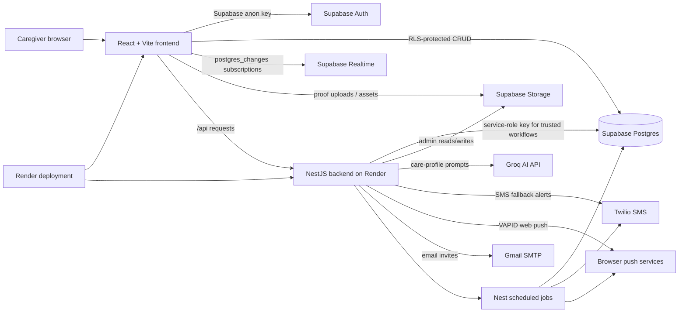

# Design & Testing

## System Architecture

CareCircle is split into three major runtime layers: a React browser client, a NestJS backend, and Supabase-managed platform services. The browser owns interactive care workflows and authenticated user sessions. The backend owns trusted operations that require server-side credentials, background scheduling, third-party integrations, and generated artifacts such as PDFs. Supabase owns authentication, Postgres data, row-level security, realtime events, and storage.

### Runtime Responsibilities

| Layer | Responsibility |
| --- | --- |
| Frontend | Renders the caregiving UI, holds the Supabase Auth session, performs RLS-protected reads/writes with the anon key, subscribes to realtime changes, and calls backend APIs for trusted workflows. |
| Backend | Exposes `/api` routes, validates requests/configuration, performs service-role Supabase operations, dispatches alerts, generates PDFs, calls AI providers, and runs scheduled jobs. |
| Supabase Auth | Manages user identity and provides JWTs used by RLS policies. |
| Supabase Postgres | Stores care groups, caregivers, patients, medication schedules, checklist items, alerts, appointments, insights, invites, and wellbeing data. |
| Supabase Realtime | Publishes database changes to subscribed frontend hooks and backend alert-cancellation subscribers. |
| Supabase Storage | Stores uploaded proof or care-related files behind Supabase access controls. |
| Groq AI API | Generates grounded care-profile answers and structured insight JSON. |
| Twilio | Sends SMS fallback reminders when push acknowledgement does not arrive in time. |
| Browser push services | Deliver VAPID web-push notifications to registered browser endpoints. |
| Render | Hosts deployable frontend/backend services and manages production environment variables. |

## Technology Choices

| Concern | Choice | Justification |
| --- | --- | --- |
| Frontend framework | React 19, Vite, TypeScript | React fits a stateful caregiver dashboard with reusable components, Vite keeps local iteration fast, and TypeScript catches contract mistakes across hooks, services, and UI state. |
| Backend framework | NestJS, TypeScript | NestJS gives clear module boundaries for AI, alerts, cron jobs, hospital summaries, invites, SMS, and reminders. Dependency injection also makes scheduled and integration-heavy services easier to test. |
| Database and auth | Supabase Auth + Postgres + RLS | Supabase provides hosted authentication, relational data, realtime subscriptions, storage, and SQL-level RLS in one platform. This matches the group-membership access model and avoids building auth/session infrastructure from scratch. |
| AI model/provider | Groq `llama-3.3-70b-versatile` | The backend uses Groq for low-latency care-profile Q&A and insight generation. Prompts are grounded in fetched profile data, and JSON responses are constrained for downstream UI use. |
| Push provider | Browser Web Push with VAPID via `web-push` | Web Push avoids a paid mobile-notification dependency for the capstone scope and works with browser subscriptions stored per user. VAPID keys keep push credentials server-side while exposing only the public key to the frontend. |
| PDF library | `pdfkit` | `pdfkit` runs server-side in Node, supports programmatic layout, and lets the hospital-summary service add sections, disclaimers, watermarks, and footers without requiring browser rendering. |
| SMS provider | Twilio | Twilio provides a mature API for E.164 phone delivery, making it suitable for fallback medication and appointment reminders when push delivery is missed or unavailable. |
| Deployment platform | Render | Render supports Git-based deploys, static sites, web services, environment variables, logs, and a low-cost/free starting point, which is appropriate for a student capstone deployment. |

## Architectural Patterns

### Realtime Pub/Sub Subscription Model

The frontend uses Supabase Realtime `postgres_changes` subscriptions for screens that must reflect care-team activity quickly. Examples include checklist updates, appointments, administration logs, journal entries, dashboard summaries, wellbeing check-ins, and latest care activity. Shared subscription behavior lives in `frontend/src/hooks/realtime/useSupabaseRealtime.ts`, while domain hooks such as `useChecklistSubscription` and `useAppointments` translate database rows into UI-specific types.

The subscription model is table-filtered rather than globally broadcast. For example, checklist subscriptions filter by `checklist_id`, and appointment subscriptions filter by `patient_id`. This reduces unnecessary updates and keeps each screen scoped to the selected care group/patient. When a channel closes or errors, hooks surface an error state; the shared realtime hook also uses limited exponential reconnect attempts.

The backend also uses realtime for alert cancellation. `ChecklistAckAlertSubscriber` subscribes to `checklist_items` updates through the service-role Supabase client. When a medication checklist item becomes `given` or `skipped`, the backend cancels open missed-medication alert records before SMS fallback dispatch can send stale alerts.

### RLS Enforcement Approach

RLS is the primary data-access boundary for browser-originated Supabase operations. The frontend uses only `VITE_SUPABASE_ANON_KEY`; authorization is enforced by Supabase JWT identity plus policies on tables such as `patients`, `care_givers`, `checklist_items`, `appointments`, and related care data.

Policies are role-aware and group-aware. Active caregivers can read group/patient data they belong to, while sensitive writes are restricted by role. Primary carers can manage patient profile and membership data; secondary carers can participate in care workflows; observers are read-mostly. The permission matrix and detailed policy catalogue below document table-level enforcement.

The backend uses `SUPABASE_SERVICE_ROLE_KEY` only for trusted server workflows that need to bypass RLS: scheduled checklist materialization, overdue detection, alert dispatch, PDF/hospital-summary assembly, AI profile loading, and realtime alert cancellation. This keeps privileged keys out of the browser and centralizes admin operations in NestJS services.

### Optimistic UI With Conflict Resolution

CareCircle uses optimistic updates where immediate feedback matters and where conflicts can be corrected by realtime or reload behavior:

- Checklist item status changes are patched locally through `patchItem`, then reconciled when Supabase Realtime emits the final `checklist_items` row.
- One-off appointment creation is inserted locally after the API returns the created appointment. Recurring appointments rely on realtime inserts for each generated occurrence.
- Appointment edits update local state for single-instance edits. Bulk future-series edits reload the appointment list because multiple rows may change at once.
- Appointment deletion removes local rows immediately after successful service completion, with future-series deletion filtering all affected occurrences.

Conflict resolution is intentionally conservative: the database event or reload becomes the source of truth. If another caregiver updates the same record, the realtime payload overwrites stale local state. For multi-row operations, the hook reloads from Supabase instead of trying to infer every changed row locally.

## Render Deployment Setup

### Service Layout

| Service | Render type | Root directory | Build command | Start/publish command |
| --- | --- | --- | --- | --- |
| Frontend | Static site | `frontend` | `npm install && npm run build` | Publish `frontend/dist` |
| Backend | Web service | `backend` | `npm install && npm run build` | `npm run start:prod` |

The frontend should be configured with the deployed backend URL for API calls and the Supabase anon key. The backend should be configured with production Supabase credentials, third-party API keys, and `NODE_ENV=production`. Crons run inside the NestJS backend process and can be disabled with `CRON_ENABLED=false` for temporary maintenance or isolated API testing.

### Environment Variable Management

Render environment variables should be entered through the Render dashboard, not committed to Git. Public browser variables must be limited to `VITE_` values that are safe to expose. Server-only secrets belong only on the backend web service.

Frontend variables:

| Variable | Required | Notes |
| --- | --- | --- |
| `VITE_SUPABASE_URL` | Yes | Supabase project URL used by the browser client. |
| `VITE_SUPABASE_ANON_KEY` | Yes | Public anon key used with RLS-protected browser queries. |
| `VITE_API_BASE_URL` | If configured by the frontend API layer | Backend Render URL, for example `https://carecircle-api.onrender.com/api`. |
| `VITE_USE_AI_MOCK` | No | Development/test toggle only; should be false or unset in production. |

Backend variables:

| Variable | Required | Notes |
| --- | --- | --- |
| `NODE_ENV` | Yes | Use `production` on Render. |
| `PORT` | Yes | Render injects a port for web services; the Nest app reads `PORT`. |
| `SUPABASE_URL` | Yes | Supabase project URL. |
| `SUPABASE_ANON_KEY` | Yes | Used when needed for non-privileged Supabase interactions. |
| `SUPABASE_SERVICE_ROLE_KEY` | Strongly recommended | Server-only. Required for admin reads/writes, crons, alerts, and workflows that bypass RLS. |
| `GROQ_API_KEY` | Yes | Required for AI Q&A and generated insights. |
| `FRONTEND_PUBLIC_URL` | Recommended | Used for deep links in invites, push, and SMS flows. |
| `GMAIL_USER` | If email invites enabled | Gmail SMTP account. |
| `GMAIL_APP_PASSWORD` | If email invites enabled | Gmail app password, never a normal account password. |
| `MAIL_FROM` | No | Optional sender override. |
| `MAIL_FROM_NAME` | No | Optional display-name override. |
| `TWILIO_ACCOUNT_SID` | If SMS enabled | Twilio account SID. |
| `TWILIO_AUTH_TOKEN` | If SMS enabled | Server-only Twilio secret. |
| `TWILIO_FROM_NUMBER` | If SMS enabled | E.164 sender number. |
| `TWILIO_DEV_TEST_TO_NUMBER` | No | Development-only SMS test recipient. |
| `VAPID_PUBLIC_KEY` | If push enabled | Public VAPID key; also exposed to browser through the backend endpoint. |
| `VAPID_PRIVATE_KEY` | If push enabled | Server-only VAPID private key. |
| `VAPID_SUBJECT` | If push enabled | `mailto:` or `https:` contact URI. |
| `CRON_ENABLED` | No | Defaults to enabled; set `false` to disable scheduled jobs. |
| `SMS_FALLBACK_DELAY_MINUTES` | No | Defaults to 10 minutes. |
| `MATERIALIZATION_BATCH_SIZE` | No | Defaults to 100 checklist items per batch. |

### Cost Comparison

Prices should be rechecked before final submission because hosting vendors can change them. As of June 14, 2026, Render lists a Hobby workspace at `$0/mo`, static sites at `$0/month`, web services starting at `$0/month`, and paid web-service instances beginning with Starter at `$7/month`. Render Postgres also lists a free tier with a 30-day limit and paid Basic options starting at `$6/month` [Render pricing](https://render.com/pricing).

| Option | Estimated app hosting cost | Fit for CareCircle capstone |
| --- | --- | --- |
| Render free/static + free web service | `$0/month` for the frontend static site and free backend web service, subject to free-tier limits | Best fit for demonstration and grading because it minimizes cost, supports Git deploys, and keeps frontend/backend services simple. |
| Render paid Starter backend | About `$7/month` for the backend web service, plus any paid database/storage/API usage | Better if the backend needs more reliable runtime behavior than the free tier. |
| Heroku Eco/Basic alternative | Heroku lists Eco dynos at `$5/month` and Basic dynos at `$7/month`; Basic is always-on [Heroku pricing](https://www.heroku.com/pricing/) | Reasonable alternative, but a capstone deployment loses Render's direct `$0` starting point for comparable backend hosting. |

The selected deployment keeps Supabase as the managed database/auth/realtime platform rather than using Render Postgres. That avoids duplicating database infrastructure and preserves RLS, Auth, Realtime, and Storage in one integrated service.

## Testing Strategy

CareCircle uses automated tests plus build checks as the main quality gate:

| Area | Command | Purpose |
| --- | --- | --- |
| Frontend build | `cd frontend && npm run build` | Type-checks the React app and verifies the Vite production bundle. |
| Frontend tests | `cd frontend && npm run test` | Runs Vitest tests for UI flows, hooks, and integration-level behavior. |
| Backend build | `cd backend && npm run build` | Type-checks and compiles the NestJS backend. |
| Backend unit tests | `cd backend && npm run test` | Runs service/controller/job tests for backend behavior. |
| Backend e2e tests | `cd backend && npm run test:e2e` | Verifies API-level behavior where e2e coverage exists. |

Targeted tests exist for realtime hooks, checklist alert cancellation, push subscriptions, weekly insight generation, hospital-summary assembly, auth/session behavior, invite flows, appointments, and dashboard widgets. RLS behavior is documented in the policy catalogue below and is also exercised indirectly through Supabase-backed integration flows.

## Permission Matrix
This section defines the access control levels for users within a care group based on their role in the `group_members` table.

| Role | Permissions |
| :--- | :--- |
| **primary_carer** | Full CRUD within own group |
| **secondary_carer** | Full CRUD on logs/journal/check-ins, read-only on medications and profile |
| **observer** | Read-only everywhere |

---

## Row Level Security (RLS) Policy Catalogue

This section documents **every** RLS policy currently enforced in the CareCircle Supabase database. Policies are grouped by table and operation. Each entry includes the policy name, the SQL expression used by PostgreSQL, and a plain-English explanation of what it **allows** and what it **blocks**.

> **How RLS works in PostgreSQL / Supabase:**
> - A `USING` clause filters which *existing* rows a user can see or act on.
> - A `WITH CHECK` clause validates whether a *new or updated* row is permitted.
> - If no policy exists for a given operation, the operation is **denied by default** when RLS is enabled.
> - Multiple policies on the same table and operation are combined with **OR** (any one passing is sufficient).

---

### 1. `care_givers` (Group Membership)

#### SELECT — "Members can view all caregivers in their groups"

| Detail | Value |
|:---|:---|
| **Roles** | `public` |
| **USING** | `is_group_member(group_id)` |

**Allows:** Any authenticated user who is an active member of a care group can view all other caregiver rows that belong to that same group. This is what powers the Members table in the UI.

**Blocks:** Users who are not members of a group cannot see any caregiver records for that group.

---

#### INSERT — "Caregiver can add themselves or primary caregiver can add other"

| Detail | Value |
|:---|:---|
| **Roles** | `public` |
| **WITH CHECK** | `(auth.uid() = caregiver_id) OR (auth.uid() = (SELECT patients.primary_caregiver_id FROM patients WHERE patients.id = care_givers.patient_id))` |

**Allows:** A user can insert a `care_givers` row only if (a) the `caregiver_id` in the new row matches their own `auth.uid()` (i.e. they are adding themselves, such as when accepting an invite), **or** (b) they are the `primary_caregiver_id` of the linked patient (i.e. the group admin is adding someone else).

**Blocks:** A secondary carer or observer cannot add other people to a group. No one can insert a row on behalf of another user unless they are the primary caregiver.

---

#### UPDATE — "Primary Carers can update members in their group"

| Detail | Value |
|:---|:---|
| **Roles** | `public` |
| **USING** | `EXISTS (SELECT 1 FROM care_givers cg WHERE cg.group_id = care_givers.group_id AND cg.caregiver_id = auth.uid() AND cg.role_in_care = 'primary_carer'::member_role AND cg.status = 'active')` |
| **WITH CHECK** | *(same as USING)* |

**Allows:** Only an active `primary_carer` within the same `group_id` can update any caregiver row in that group. This is the policy that powers the role-change dropdown in the Members Management screen.

**Blocks:** Secondary carers and observers cannot change anyone's role, status, or any other field on the `care_givers` table through this policy.

---

#### UPDATE — "Caregiver can update their own membership; primary caregiver ca…"

| Detail | Value |
|:---|:---|
| **Roles** | `public` |
| **USING** | `(auth.uid() = caregiver_id) OR (auth.uid() = (SELECT patients.primary_caregiver_id FROM patients WHERE patients.id = care_givers.patient_id))` |
| **WITH CHECK** | *(same as USING)* |

**Allows:** A user can update their *own* caregiver row (e.g. updating notification preferences), **or** the primary caregiver of the linked patient can update any member's row.

**Blocks:** A user cannot update another user's membership row unless they are the primary caregiver for that patient.

> **Note:** Because PostgreSQL combines multiple UPDATE policies with OR, a user passes the UPDATE check if *either* of the two UPDATE policies above is satisfied.

---

#### DELETE — "Only primary caregiver can remove caregivers"

| Detail | Value |
|:---|:---|
| **Roles** | `public` |
| **USING** | `auth.uid() = (SELECT patients.primary_caregiver_id FROM patients WHERE patients.id = care_givers.patient_id)` |

**Allows:** Only the primary caregiver of the linked patient can delete (remove) a caregiver from the group.

**Blocks:** Secondary carers and observers cannot remove any member from a group. A member cannot remove themselves — only the primary caregiver can do that.

---

### 2. `care_group` (Care Circles)

#### SELECT — "Users can view their care circle memberships"

| Detail | Value |
|:---|:---|
| **Roles** | `authenticated` |
| **USING** | `auth.uid() = primary_caregiver_id` |

**Allows:** Only the primary caregiver (group creator) can directly read `care_group` rows. Other members access group data indirectly through the `care_givers` join.

**Blocks:** Non-primary-caregiver users cannot directly query the `care_group` table.

---

#### INSERT — "Users can be able to insert records"

| Detail | Value |
|:---|:---|
| **Roles** | `authenticated` |
| **WITH CHECK** | `auth.uid() = primary_caregiver_id` |

**Allows:** Any authenticated user can create a new care group, as long as they set themselves as the `primary_caregiver_id`.

**Blocks:** No user can create a group and assign someone else as the primary caregiver.

---

> **Note:** No UPDATE or DELETE policies exist on `care_group`. This means updates and deletions are **completely blocked** by RLS for all users via the PostgREST API.

---

### 3. `care_recipients`

#### SELECT — "Enable authenticated caregivers to select records"

| Detail | Value |
|:---|:---|
| **Roles** | `authenticated` |
| **USING** | `auth.uid() = (SELECT care_group.primary_caregiver_id FROM care_group)` |

**Allows:** The primary caregiver can view care recipient records.

**Blocks:** Non-primary users cannot directly read care recipient data from this table.

---

#### INSERT — "Enabled insertions for caregivers"

| Detail | Value |
|:---|:---|
| **Roles** | `authenticated` |
| **WITH CHECK** | `auth.uid() = (SELECT care_group.primary_caregiver_id FROM care_group)` |

**Allows:** Only the primary caregiver can add new care recipient records.

**Blocks:** Secondary carers and observers cannot create care recipient entries.

---

#### UPDATE — "Caregivers are able to update the records"

| Detail | Value |
|:---|:---|
| **Roles** | `authenticated` |
| **USING** | `auth.uid() = (SELECT care_group.primary_caregiver_id FROM care_group)` |
| **WITH CHECK** | *(same as USING)* |

**Allows:** Only the primary caregiver can modify care recipient records.

**Blocks:** All other roles are denied write access.

---

> **Note:** No DELETE policy exists on `care_recipients`. Deletions are **blocked for everyone**.

---

### 4. `patients`

#### SELECT — "patients select for active caregivers"

| Detail | Value |
|:---|:---|
| **Roles** | `authenticated` |
| **USING** | `(primary_caregiver_id = auth.uid()) OR (EXISTS (SELECT 1 FROM care_givers cg WHERE cg.patient_id = patients.id AND cg.caregiver_id = auth.uid() AND cg.status = 'active'))` |

**Allows:** The primary caregiver can always view the patient. Additionally, any active caregiver linked to that patient (regardless of role — `primary_carer`, `secondary_carer`, or `observer`) can view the patient record.

**Blocks:** Users with no active `care_givers` relationship to the patient cannot see the record.

---

#### INSERT — "patients insert by primary caregiver"

| Detail | Value |
|:---|:---|
| **Roles** | `authenticated` |
| **WITH CHECK** | `primary_caregiver_id = auth.uid()` |

**Allows:** A user can create a patient record only if they set themselves as the `primary_caregiver_id`.

**Blocks:** No one can create a patient and assign another user as primary caregiver.

---

#### UPDATE — "patients update by active primary carer"

| Detail | Value |
|:---|:---|
| **Roles** | `public` |
| **USING** | `EXISTS (SELECT 1 FROM care_givers cg WHERE cg.patient_id = patients.id AND cg.caregiver_id = auth.uid() AND cg.role_in_care = 'primary_carer'::member_role AND cg.status = 'active')` |

**Allows:** Only an active `primary_carer` linked to the patient can update the patient record.

**Blocks:** `secondary_carer` and `observer` roles are denied. This enforces the permission matrix rule that non-primary roles have read-only access to patient profiles.

---

#### DELETE — "patients delete by active primary carer"

| Detail | Value |
|:---|:---|
| **Roles** | `public` |
| **USING** | `EXISTS (SELECT 1 FROM care_givers cg WHERE cg.patient_id = patients.id AND cg.caregiver_id = auth.uid() AND cg.role_in_care = 'primary_carer'::member_role AND cg.status = 'active')` |

**Allows:** Only an active `primary_carer` linked to the patient can delete the patient record.

**Blocks:** All other roles are denied.

---

### 5. `medications`

#### SELECT — "caregivers_read_medications"

| Detail | Value |
|:---|:---|
| **Roles** | `public` |
| **USING** | `is_caregiver_for(patient_id)` |

**Allows:** Any user who is a caregiver for the patient (any role) can read medication records. This satisfies the permission matrix: all three roles have at least read access to medications.

**Blocks:** Users with no caregiver relationship cannot view medications.

---

#### INSERT — "caregivers_insert_medications"

| Detail | Value |
|:---|:---|
| **Roles** | `public` |
| **WITH CHECK** | `is_caregiver_for(patient_id) AND (prescribed_by = auth.uid())` |

**Allows:** A caregiver can insert a medication only if they are linked to the patient **and** they set themselves as the `prescribed_by` user.

**Blocks:** Observers and secondary carers can still technically pass `is_caregiver_for()`, so this policy relies on the application layer to restrict observer writes. The `prescribed_by = auth.uid()` check prevents impersonation.

---

#### UPDATE — "no_direct_updates"

| Detail | Value |
|:---|:---|
| **Roles** | `public` |
| **USING** | `false` |

**Allows:** Nothing. This policy unconditionally denies all direct UPDATE operations.

**Blocks:** **Everyone.** Medication updates must go through a server-side function or edge function that bypasses RLS with a service-role key.

---

#### DELETE — "no_direct_deletes"

| Detail | Value |
|:---|:---|
| **Roles** | `public` |
| **USING** | `false` |

**Allows:** Nothing. This policy unconditionally denies all direct DELETE operations.

**Blocks:** **Everyone.** Medication deletions are handled through server-side functions only.

---

### 6. `daily_medication_checklists`

#### SELECT — "Users see checklists for their families"

| Detail | Value |
|:---|:---|
| **Roles** | `public` |
| **USING** | `group_id IN (SELECT group_id FROM care_group WHERE care_group.primary_caregiver_id = auth.uid())` |

**Allows:** The primary caregiver of a care group can view all daily medication checklists belonging to that group.

**Blocks:** Non-primary users cannot directly query this table. Secondary carers and observers are denied.

---

> **Note:** No INSERT, UPDATE, or DELETE policies exist on this table. All write operations are **blocked for everyone** via the PostgREST API.

---

### 7. `medication_confirmations`

#### SELECT — "group_members_select_confirmations"

| Detail | Value |
|:---|:---|
| **Roles** | `authenticated` |
| **USING** | `EXISTS (SELECT 1 FROM checklist_items ci JOIN daily_medication_checklists dmc ON dmc.id = ci.checklist_id JOIN care_givers cg ON cg.group_id = dmc.group_id WHERE ci.id = medication_confirmations.checklist_item_id AND cg.caregiver_id = auth.uid() AND cg.status = 'active')` |

**Allows:** Any active group member (any role) can view medication confirmations for checklist items within their group.

**Blocks:** Users not in the group cannot see confirmations.

---

#### INSERT — "caregivers_insert_own_confirmation"

| Detail | Value |
|:---|:---|
| **Roles** | `authenticated` |
| **WITH CHECK** | `auth.uid() = carer_id` |

**Allows:** A caregiver can record their own medication confirmation (setting themselves as `carer_id`).

**Blocks:** No one can insert a confirmation on behalf of another user.

---

> **Note:** No UPDATE or DELETE policies exist. Confirmations are **immutable** — once recorded, they cannot be modified or removed via the API.

---

### 8. `invites`

#### SELECT — "select own invites"

| Detail | Value |
|:---|:---|
| **Roles** | `authenticated` |
| **USING** | `email = (auth.jwt() ->> 'email')` |

**Allows:** A user can only view invites addressed to their own email address.

**Blocks:** Users cannot see invites sent to other people.

---

#### INSERT — "admins can create invites"

| Detail | Value |
|:---|:---|
| **Roles** | `authenticated` |
| **WITH CHECK** | `true` |

**Allows:** Any authenticated user can create an invite record. The application layer controls who should be allowed to send invites (typically the primary carer).

**Blocks:** Unauthenticated (anon) requests are denied.

---

> **Note:** No UPDATE or DELETE policies exist. Invites are managed server-side via RPC functions (`accept_group_invite`, `reject_group_invite`).

---

### 9. `messages`

#### SELECT — "Users can view their messages"

| Detail | Value |
|:---|:---|
| **Roles** | `public` |
| **USING** | `(auth.uid() = sender_id) OR (auth.uid() = recipient_id)` |

**Allows:** A user can read messages where they are either the sender or the recipient.

**Blocks:** Users cannot read messages between other users.

---

> **Note:** No INSERT, UPDATE, or DELETE policies are documented. Message creation and management is handled server-side.

---

### 10. `notifications`

#### SELECT — "Users can view own notifications"

| Detail | Value |
|:---|:---|
| **Roles** | `public` |
| **USING** | `auth.uid() = user_id` |

**Allows:** A user can only read their own notifications.

**Blocks:** Users cannot see notifications belonging to other users.

---

#### UPDATE — "Users can update own notifications"

| Detail | Value |
|:---|:---|
| **Roles** | `public` |
| **USING** | `auth.uid() = user_id` |

**Allows:** A user can update their own notifications (e.g. marking as read).

**Blocks:** Users cannot modify another user's notifications.

---

> **Note:** No INSERT or DELETE policies exist. Notification creation is server-side; deletion is blocked.

---

### 11. `profiles`

#### SELECT — "Users can view all profiles"

| Detail | Value |
|:---|:---|
| **Roles** | `public` |
| **USING** | `true` |

**Allows:** All authenticated users can view all profile records. This is intentional — profile data (name, avatar) is needed to render member lists across the app.

**Blocks:** Nothing. This is a fully open read policy.

---

#### UPDATE — "Users can update own profile"

| Detail | Value |
|:---|:---|
| **Roles** | `public` |
| **USING** | `auth.uid() = id` |

**Allows:** A user can only update their own profile row.

**Blocks:** No user can modify another user's profile.

---

> **Note:** No INSERT or DELETE policies exist. Profile rows are created automatically by a database trigger (`verify_profile_trigger`) on user sign-up; deletion is blocked.

---

### 12. `storage.objects` (File Storage)

#### SELECT — "Give users authenticated access to folder 1oj01fe_0"

| Detail | Value |
|:---|:---|
| **Roles** | `public` |
| **Bucket** | `avatars` |
| **USING** | `bucket_id = 'avatars' AND (storage.foldername(name))[1] = 'private' AND auth.role() = 'authenticated'` |

**Allows:** Any authenticated user can read files in the `avatars` bucket under the `private/` folder.

**Blocks:** Unauthenticated users and files outside `private/` are denied.

---

#### SELECT — "patient avatars read by active caregivers" / "patient avatars readable by active caregivers"

| Detail | Value |
|:---|:---|
| **Roles** | `authenticated` |
| **Bucket** | `patient-avatars` |
| **USING** | `bucket_id = 'patient-avatars' AND EXISTS (SELECT 1 FROM care_givers cg WHERE cg.patient_id::text = (storage.foldername(objects.name))[1] AND cg.caregiver_id = auth.uid() AND cg.status = 'active')` |

**Allows:** An active caregiver can read patient avatar files where the folder name matches a `patient_id` they are linked to. All roles (`primary_carer`, `secondary_carer`, `observer`) can read.

**Blocks:** Users not linked to the patient cannot view that patient's avatar.

> **Note:** There are two duplicate SELECT policies with this same logic. They are functionally equivalent.

---

#### INSERT — "patient avatars insert by primary carer"

| Detail | Value |
|:---|:---|
| **Roles** | `public` |
| **Bucket** | `avatars` |
| **WITH CHECK** | `bucket_id = 'avatars' AND EXISTS (SELECT 1 FROM care_givers cg WHERE cg.caregiver_id = auth.uid() AND cg.role_in_care = 'primary_carer'::member_role AND cg.status = 'active')` |

**Allows:** Only an active `primary_carer` can upload new files to the `avatars` bucket.

**Blocks:** `secondary_carer` and `observer` roles cannot upload avatars.

---

#### INSERT — "Give users authenticated access to folder 1oj01fe_1"

| Detail | Value |
|:---|:---|
| **Roles** | `public` |
| **Bucket** | `avatars` |
| **WITH CHECK** | `bucket_id = 'avatars' AND (storage.foldername(name))[1] = 'private' AND auth.role() = 'authenticated'` |

**Allows:** Any authenticated user can upload files to the `avatars/private/` folder (used for user profile avatars).

**Blocks:** Unauthenticated users and uploads outside the `private/` folder path.

---

#### UPDATE — "patient avatars update by primary carer"

| Detail | Value |
|:---|:---|
| **Roles** | `public` |
| **Bucket** | `avatars` |
| **USING** | `bucket_id = 'avatars' AND EXISTS (SELECT 1 FROM care_givers cg WHERE cg.caregiver_id = auth.uid() AND cg.role_in_care = 'primary_carer'::member_role AND cg.status = 'active')` |

**Allows:** Only an active `primary_carer` can overwrite/update existing avatar files.

**Blocks:** `secondary_carer` and `observer` roles cannot modify avatar files.

---

#### UPDATE — "Give users authenticated access to folder 1oj01fe_2"

| Detail | Value |
|:---|:---|
| **Roles** | `public` |
| **Bucket** | `avatars` |
| **USING** | `bucket_id = 'avatars' AND (storage.foldername(name))[1] = 'private' AND auth.role() = 'authenticated'` |

**Allows:** Any authenticated user can update their own files in `avatars/private/`.

**Blocks:** Unauthenticated users.

---

#### DELETE — "patient avatars delete by primary carer"

| Detail | Value |
|:---|:---|
| **Roles** | `public` |
| **Bucket** | `avatars` |
| **USING** | `bucket_id = 'avatars' AND EXISTS (SELECT 1 FROM care_givers cg WHERE cg.caregiver_id = auth.uid() AND cg.role_in_care = 'primary_carer'::member_role AND cg.status = 'active')` |

**Allows:** Only an active `primary_carer` can delete avatar files from the `avatars` bucket.

**Blocks:** `secondary_carer` and `observer` roles cannot delete avatar files.

---

#### DELETE — "Give users authenticated access to folder 1oj01fe_3"

| Detail | Value |
|:---|:---|
| **Roles** | `public` |
| **Bucket** | `avatars` |
| **USING** | `bucket_id = 'avatars' AND (storage.foldername(name))[1] = 'private' AND auth.role() = 'authenticated'` |

**Allows:** Any authenticated user can delete their own files in `avatars/private/`.

**Blocks:** Unauthenticated users.

---

### 10. `handover_journal_entries`

#### SELECT — "Group members can view handover journal entries"

| Detail | Value |
|:---|:---|
| **Roles** | `public` |
| **USING** | `EXISTS (SELECT 1 FROM care_givers cg WHERE cg.group_id = handover_journal_entries.group_id AND cg.caregiver_id = auth.uid() AND cg.status = 'active')` |

**Allows:** Any active member of the care group can read every handover journal entry for that group. This satisfies the requirement that all family roles, including observers, can view the handover log.

**Blocks:** Users who are not active members of the group cannot view that group's handover journal entries.

---

#### INSERT — "Carers can add handover journal entries"

| Detail | Value |
|:---|:---|
| **Roles** | `public` |
| **WITH CHECK** | `author_id = auth.uid() AND EXISTS (SELECT 1 FROM care_givers cg WHERE cg.group_id = handover_journal_entries.group_id AND cg.caregiver_id = auth.uid() AND cg.status = 'active' AND cg.role_in_care IN ('primary_carer'::member_role, 'secondary_carer'::member_role))` |

**Allows:** Active primary and secondary carers can write their own handover journal entries for the group.

**Blocks:** Observers cannot create handover journal entries, and no user can create an entry on behalf of another author.

---

#### UPDATE — "Authors can edit handover journal entries for 60 minutes"

| Detail | Value |
|:---|:---|
| **Roles** | `public` |
| **USING** | `author_id = auth.uid() AND created_at >= timezone('utc', now()) - interval '60 minutes'` |
| **WITH CHECK** | *(same as USING)* |

**Allows:** The original author of a handover journal entry can edit their own entry for up to 60 minutes after it was created.

**Blocks:** Other members cannot edit someone else's entry, and authors lose edit access once the 60-minute window has expired.

---

### 11. `weekly_shift_assignments`

#### SELECT — "Group members can view weekly shift assignments"

| Detail | Value |
|:---|:---|
| **Roles** | `public` |
| **USING** | `EXISTS (SELECT 1 FROM care_givers cg WHERE cg.group_id = weekly_shift_assignments.group_id AND cg.caregiver_id = auth.uid() AND cg.status = 'active')` |

**Allows:** Any active member of the care group can read the weekly shift coverage grid, including observers.

**Blocks:** Users who are not active members of the group cannot see shift assignments for that group.

---

#### INSERT — "Primary carers can create weekly shift assignments"

| Detail | Value |
|:---|:---|
| **Roles** | `public` |
| **WITH CHECK** | `EXISTS (SELECT 1 FROM care_givers cg WHERE cg.group_id = weekly_shift_assignments.group_id AND cg.caregiver_id = auth.uid() AND cg.status = 'active' AND cg.role_in_care = 'primary_carer'::member_role) AND (assigned_caregiver_id IS NULL OR EXISTS (SELECT 1 FROM care_givers cg WHERE cg.group_id = weekly_shift_assignments.group_id AND cg.caregiver_id = weekly_shift_assignments.assigned_caregiver_id AND cg.status = 'active'))` |

**Allows:** Only an active `primary_carer` can create or mark a weekly slot assignment for the group. The selected assignee must either be empty or an active group member.

**Blocks:** Secondary carers and observers cannot assign slots, and no user can assign a slot to someone outside the care group.

---

#### UPDATE — "Primary carers can update weekly shift assignments"

| Detail | Value |
|:---|:---|
| **Roles** | `public` |
| **USING** | `EXISTS (SELECT 1 FROM care_givers cg WHERE cg.group_id = weekly_shift_assignments.group_id AND cg.caregiver_id = auth.uid() AND cg.status = 'active' AND cg.role_in_care = 'primary_carer'::member_role)` |
| **WITH CHECK** | `EXISTS (SELECT 1 FROM care_givers cg WHERE cg.group_id = weekly_shift_assignments.group_id AND cg.caregiver_id = auth.uid() AND cg.status = 'active' AND cg.role_in_care = 'primary_carer'::member_role) AND (assigned_caregiver_id IS NULL OR EXISTS (SELECT 1 FROM care_givers cg WHERE cg.group_id = weekly_shift_assignments.group_id AND cg.caregiver_id = weekly_shift_assignments.assigned_caregiver_id AND cg.status = 'active'))` |

**Allows:** Only an active `primary_carer` can change an existing weekly shift assignment, including clearing a slot back to unassigned.

**Blocks:** Non-primary roles cannot reassign or clear coverage slots.

---

### 12. `weekly_shift_assignment_history`

#### SELECT — "Group members can view weekly shift assignment history"

| Detail | Value |
|:---|:---|
| **Roles** | `public` |
| **USING** | `EXISTS (SELECT 1 FROM care_givers cg WHERE cg.group_id = weekly_shift_assignment_history.group_id AND cg.caregiver_id = auth.uid() AND cg.status = 'active')` |

**Allows:** Any active member of the care group can read the historical record of shift changes for that group. This keeps the data queryable for downstream wellbeing features.

**Blocks:** Non-members cannot inspect shift history.

---

### Summary: Role Impact Across All Tables

| Table | primary_carer | secondary_carer | observer |
|:---|:---|:---|:---|
| `care_givers` | SELECT, INSERT, UPDATE, DELETE | SELECT, INSERT (self only) | SELECT, INSERT (self only) |
| `care_group` | SELECT, INSERT | — | — |
| `care_recipients` | SELECT, INSERT, UPDATE | — | — |
| `patients` | SELECT, INSERT, UPDATE, DELETE | SELECT | SELECT |
| `medications` | SELECT, INSERT | SELECT, INSERT | SELECT |
| `daily_medication_checklists` | SELECT | — | — |
| `handover_journal_entries` | SELECT, INSERT, UPDATE (own, 60 mins) | SELECT, INSERT, UPDATE (own, 60 mins) | SELECT |
| `weekly_shift_assignments` | SELECT, INSERT, UPDATE | SELECT | SELECT |
| `weekly_shift_assignment_history` | SELECT | SELECT | SELECT |
| `medication_confirmations` | SELECT, INSERT | SELECT, INSERT | SELECT, INSERT |
| `invites` | SELECT (own), INSERT | SELECT (own), INSERT | SELECT (own), INSERT |
| `messages` | SELECT (own) | SELECT (own) | SELECT (own) |
| `notifications` | SELECT (own), UPDATE (own) | SELECT (own), UPDATE (own) | SELECT (own), UPDATE (own) |
| `profiles` | SELECT (all), UPDATE (own) | SELECT (all), UPDATE (own) | SELECT (all), UPDATE (own) |
| `storage.objects` | SELECT, INSERT, UPDATE, DELETE | SELECT | SELECT |

---

## **AI Q&A Acceptance Test Summary**

**Test Date:** 2026-05-23

**Tester:** QA Team

**Test Patient:** Kenn Kun

**Backend URL:** localhost:3000

**Frontend URL:** localhost:5173

### Results (summary)

- Total questions tested: **20**
- Passed: **20**
- Failed: **0**
- Pass rate: **100%**
- Average latency: **1,245 ms**
- 95th percentile latency: **1,850 ms**
- Meets 8-second latency requirement: **Yes**

### Key Findings

- Grounding: All answerable questions returned accurate, profile-based responses with no hallucinations.
- Refusal behaviour: All absent-data questions were refused correctly and consistently using the authorised phrasing.
- Latency: Performance is well within the 8,000 ms requirement.

For full test details see `QA.md` or the linked PR/issue for this feature branch.
